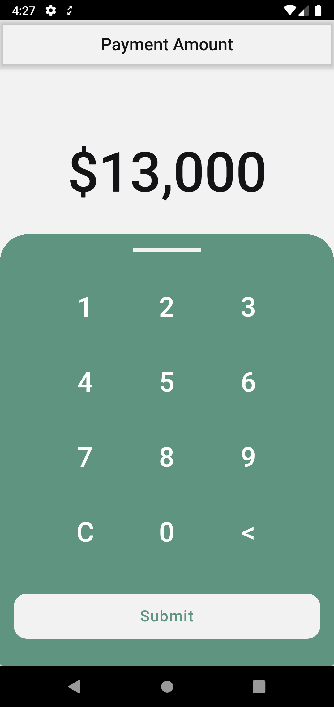

# PayPos project

This project consists of the presentation layer of a payment app.

    
    
    
    

## Technology

- kotlin
- coroutine flow
- Mockito2
- Jetpack Compose
- Hilt
- MVVM arch
- Canvas for custom-view
